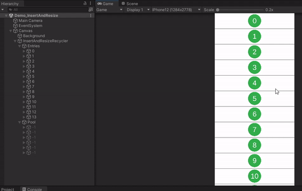
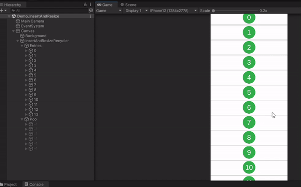
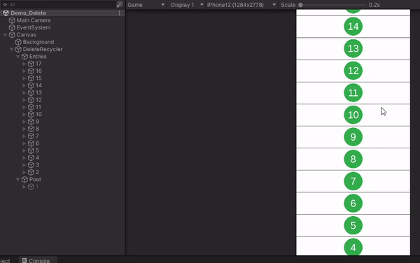
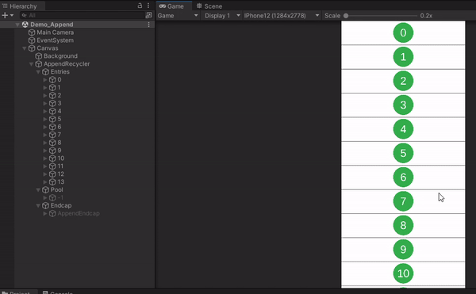
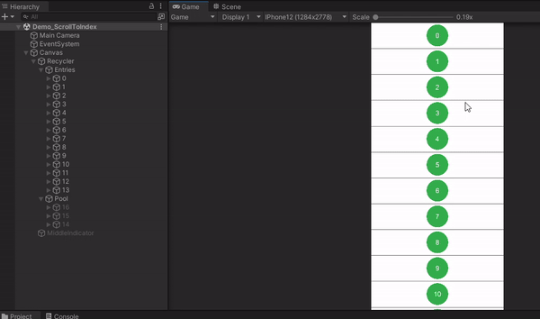
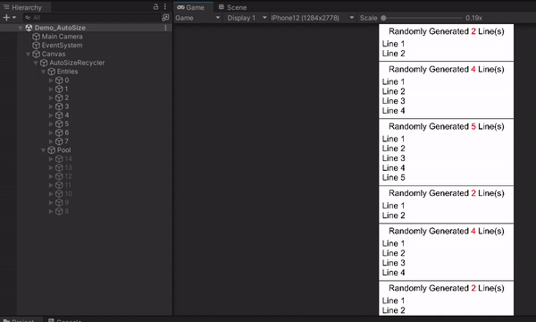
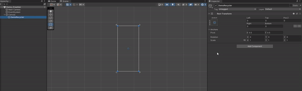
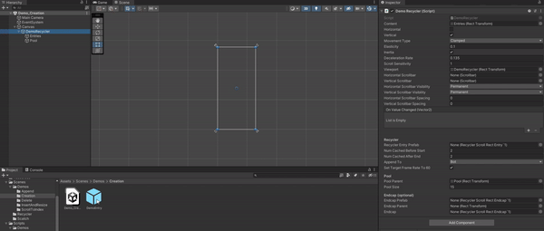
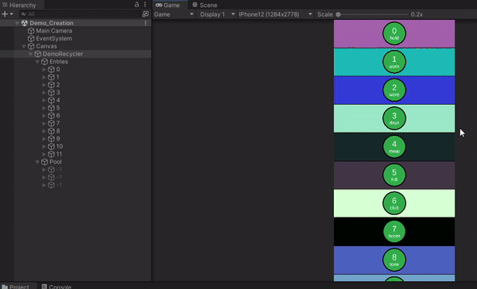

# Intro
A Recycler View for Unity, as a native one is not provided.

### Why do I need a Recycler?
Lists of things to display often take up more space than what is available on screen (think of endlessly scrolling through emails or text messages).
It makes no sense to waste resources on displaying what can't be seen. If we can only see 20 text messages, why spend time creating the entire 1000 message conversation?

Recyclers address this. Instead of creating the entire list of things, we only create what can be seen, and a few entries just off-screen to smoothly scroll into.
If we can only see 20 text messages on screen at a time, and we keep 2 extra messages cached on each end, waiting just above and below the screen to smoothly scroll into, we'll be managing the lifecycle of 24 things to display instead of the full 1000.
This increases performance and reduces headaches. Once an entry has gone far enough offscreen, it is not thrown away but re-used for the next visible entry we are scrolling in to.

In the feature videos below, on the left hand side (the hierarchy), you will see the current list of entries. The numbers on these entries will change as we scroll through the list.
Each number represents the current piece of data (its index) that an entry is displaying. 
Importantly, the number of entries stays small; even when we're scrolling through a list of 100s of pieces of data we always have < 20 active at any given moment. 
The changing numbers is exactly the process of recycling: re-using an old entry with new data.

### Why choose this Recycler?
Transforming Unity's ScrollRect into a Recycler is already difficult, and other packages can be found implementing a Recycler, but none offer the functionality given here.
Other Recylers assume:
- entries with static dimensions (a text message would be unable to resize and show an asynchronously loaded preview image)
- entries all with the same dimensions (each text message would be required to take up the same amount of room in the conversation, leaving lots of empty space)
- the list stays static: no inserting or removing entries without recreating the entire list (no inserting or deleting text messages)
- no endcaps: sometimes you want one slightly different entry from the rest at the bottom of the list as it serves a different purpose (for example, a loading indicator that fetches and appends the next page of text messages from a database)
- no scrolling to an entry: unless you calculate it's (x,y) or normalized scroll position yourself (which is usually unintuitive)
- no auto-calculated layout entries: making entries that need to deal with dynamically sized content difficult (for example, an entry with text that changes length based on the localized language) 

Here, all those cases are covered with the following features: 
- Appending
- Prepending
- Insertion
- Deletion
- Pooling 
- Dynamically sized entries (auto-calculation supported)
- Resizing (auto-calculation supported)
- Endcaps
- Scrolling to any index (including those off screen)

### Code
The code is currently in a state of being finalized and documented. It can be found under:
- [RecyclerUnity/Assets/Scripts/Recycler/](RecyclerUnity/Assets/Scripts/Recycler/)

The two core classes - the Recycler and its entries - can be found under: 
- [RecyclerUnity/Assets/Scripts/Recycler/RecyclerScrollRect.cs](RecyclerUnity/Assets/Scripts/Recycler/RecyclerScrollRect.cs)
- [RecyclerUnity/Assets/Scripts/Recycler/RecyclerScrollRectEntry.cs](RecyclerUnity/Assets/Scripts/Recycler/RecyclerScrollRectEntry.cs) 

# Feature Videos
### Basic Functionality


### Insertion/Resizing


### Deletion (15, 17, 18)


### Appending/Prepending/Endcap
- Equivalent behaviour is available for prepending.
- Similar to insertion (insertion can accomplish the exact same thing), but more efficient as we know we are appending to the ends only and won't be pushing around any currently visible entries.
  


### Scrolling to index (45)
- Includes indices that are not currently active in the recycler.
- Works with dynamically sized entries.
  


### Auto-sized entries
- Here each entry generates a random number of lines of text. The entry is auto-sized to fit the text using a VerticalLayoutGroup and a ContentSizeFitter.
- (Note: precautions have been taken to prevent inefficent spam layout calculations. See [Nuances](https://github.com/surmwill/recycler_unity/#preventing-spam-layout-recalculations).)



# Getting Started

You will need 3 things:
1. The data you will pass to the Recycler (a normal C# class).
2. A recycler entry to bind the data to (a prefab).
3. The Recycler itself (a component).

### The Data

Here is some sample data in which we store a word to display and a background color.

```
public class DemoRecyclerData : IRecyclerScrollRectData<string>
{
    // IRecyclerScrollRectData<string> implementation
    public string Key => Word;

    public string Word { get; private set; }
    
    public Color BackgroundColor { get; private set; }
}
```

Each piece of data is required to have a unique key, implemented by the `IRecyclerScrollRectData<TEntryDataKey>` interface. 
As entries get added and removed their indices change. Instead of keeping track of all the shifting yourself, you can reference pieces of data by their unchanging keys.

(Tip: a quick way to generate unique keys without much thought or structure is to generate a `Guid.NewGuid().ToString()` as a key. Keys are passed as a parameter to reference specific pieces of data;
if you do not require such methods, the actual key is not that important apart from needing _something_ that is unique).

### The Recycler Entry

Recycler entries are prefabs that will get bound to your data. To begin, create the prefab. 

To make it operable with the Recycler you must include a `RecyclerScrollRectEntry<TEntryData, TEntryDataKey>` component at the root of the prefab. 
Specifically, as generic classes cannot be components, you must create an of instance of the generic class with your data and its corresponding key as the types `class DemoRecyclerEntry : RecyclerScrollRectEntry<DemoRecyclerData, string>`

Upon creating the class you will be asked to implement three different lifecycle methods. Each can be left empty until use of them is required:

```
protected override void OnBindNewData(DemoRecyclerData entryData)
{
    // Called when this entry has been retrieved from the recycling pool and is being bound to new data
}

protected override void OnRebindExistingData()
{
    // Called instead of OnBindNewData when this entry is retrieved from the recycling pool and bound.
    // Here, the only difference is the data being bound is the same data that the entry had before (and still currently contains).
    // By default, nothing gets reset when an entry gets sent to recycling; hence we can pick up from the state right where we left off, just before it got recycled.
    // We might, for example, resume a paused async operation here instead of starting it all over again.
}

protected override void OnSentToRecycling()
{
    // Called when this entry has been sent back to the recycling pool   
}
```

We will use the passed data in `OnBindNewData` to adjust the appearance of the entry:

```
[SerializeField]
private Text _wordText = null;

[SerializeField]
private Text _indexText = null;

[SerializeField]
private Image _background = null;

protected override void OnBindNewData(DemoRecyclerData entryData)
{
    // Set the word and background color to whatever is passed in the data
    _wordText.text = entryData.Word;
    _background.color = entryData.BackgroundColor;

    // Display the index (note that Index is a property found in the base class)
    _indexText.text = Index.ToString();
}
```

Note that if this entry gets rebound to the same data, (for our case) no action is needed and `OnRebindExistingData` can be left empty. 
The entry will already have the text and background color set up from its initial `OnBindNewData` call.
By default, nothing gets reset when it gets sent to recycling - the appearance holds steady.

### The Recycler

Similar to creating the entry, we have a base `class RecyclerScrollRect<TEntryData, TKeyEntryData>`, but must create an instance of this generic class (working with our data and its key) to be used as a component.

```
public class DemoRecycler : RecyclerScrollRect<DemoRecyclerData, string>
{
    // Empty, unless the user wishes to add something
}
```

Then create an empty RectTransform with the desired dimensions for the Recycler. Add our `DemoRecycler` component to that RectTransform. 

Two child GameObjects will be created: `Entries` and `Pool`



Serialize our entry prefab in the Recycler component. The pool is now filled up with entries.



Finally, create the actual data and append it to the Recycler.

```
[SerializeField]
private DemoRecycler _recycler = null;

private static readonly string[] Words =
{ 
    "hold", "work", "wore", "days", "meat",
    "hill", "club", "boom", "tone", "grey",
    "bowl", "bell", "kick", "hope", "over",
    "year", "camp", "tell", "main", "lose",
    "earn", "name", "hang", "bear", "heat",
    "trip", "calm", "pace", "home", "bank",
    "cell", "lake", "fall", "fear", "mood",
    "head", "male", "evil", "toll", "base"
};

private void Start()
{
     // Create data containing the words from the array, each with a random background color
    DemoRecyclerData[] entryData = new DemoRecyclerData[Words.Length];
    for (int i = 0; i < Words.Length; i++)
    {
        entryData[i] = new DemoRecyclerData(Words[i], Random.ColorHSV());
    }
    
    _recycler.AppendEntries(entryData);
}
```

### End Result



# Documentation

## RecyclerScrollRect

### InsertAtIndex
```
public void InsertAtIndex(int index, TEntryData entryData, FixEntries fixEntries)
```
Inserts an entry at the given index. Existing entries will be shifted - equivalent behaviour to inserting into a list.
- `index:` the index to insert the entry at
- `entryData:` the data representing the entry
- `fixEntries:` if we are inserting into the visible window of entries, then we'll need to make some room by pushing some existing entries aside. This defines how and what entries will get moved.

### InsertAtKey
```
public void InsertAtKey(TKeyEntryData insertAtKey, TEntryData entryData, FixEntries fixEntries)
```
Inserts an entry at the given key. Existing entries will be shifted - equivalent behaviour to inserting into a list.
- `insertAtKey:` the key to insert the entry at
- `entryData:` the data representing the entry
- `fixEntries:` if we are inserting into the visible window of entries, then we'll need to make some room by pushing some existing entries aside. This defines how and what entries will get moved.

### InsertRangeAtIndex
```
public void InsertRangeAtIndex(int index, IEnumerable<TEntryData> entryData, FixEntries fixEntries)
```
Inserts a range of entries at the given index. Existing entries will be shifted - equivalent behaviour to inserting into a list.
- `index:` the index to insert the entries at
- `entryData:` the data for the entries
- `fixEntries:` if we are inserting into the visible window of entries, then we'll need to make some room by pushing some existing entries aside. This defines how and what entries will get moved.

### InsertRangeAtKey
```
public void InsertRangeAtKey(TKeyEntryData insertAtKey, IEnumerable<TEntryData> entryData, FixEntries fixEntries)
```
Inserts a range of entries at the given key. Existing entries will be shifted - equivalent behaviour to inserting into a list.
- `insertAtKey:` the index to insert the entries at
- `entryData:` the data for the entries
- `fixEntries:` if we are inserting into the visible window of entries, then we'll need to make some room by pushing some existing entries aside. This defines how and what entries will get moved.

### RemoveAtIndex
```
public void RemoveAtIndex(int index, FixEntries fixEntries)
```
Removes an entry at the given index. Existing entries will be shifted - equivalent behaviour to removing from a list.
- `index:` the index of the entry to remove
- `fixEntries:` if we are removing from the visible window of entries, then extra room will be created, pulling entries in. This defines how and what entries will move to fill up the new space.

### RemoveAtKey
```
public void RemoveAtIndex(TKeyEntryData removeAtKey, FixEntries fixEntries)
```
Removes an entry at the given key. Existing entries will be shifted - equivalent behaviour to removing from a list.
- `removeAtKey:` the key of the entry to remove
- `fixEntries:` if we are removing from the visible window of entries, then extra room will be created, pulling entries in. This defines how and what entries will move to fill up the new space.

### RemoveRangeAtIndex
```
public void RemoveRangeAtIndex(int index, int count, FixEntries fixEntries)
```
Removes a range of entries starting from the given index. Existing entries will be shifted - equivalent behavior to removing from a list.
- `index:` the index to start removal at
- `count:` the number of entries to remove
- `fixEntries:` if we are removing from the visible window of entries, then extra room will be created, pulling entries in. This defines how and what entries will move to fill up the new space.

### RemoveRangeAtKey
```
public void RemoveRangeAtKey(TKeyEntryData removeAtKey, int count, FixEntries fixEntries)
```
Removes a range of entries starting from the given key. Existing entries will be shifted - equivalent behavior to removing from a list.
- `removeAtKey:` the key of the entry to start removal at
- `count:` the number of entries to remove
- `fixEntries:` if we are removing from the visible window of entries, then extra room will be created, pulling entries in. This defines how and what entries will move to fill up the new space.

### AppendEntries
```
public void AppendEntries(IEnumerable<TEntryData> entries)
```
Appends a range of entries to the end of the existing list of data. 

Functionally equivalent to insertion - but more efficent - as we know we are tacking things on to the end, not inserting into the middle and pushing things on/off screen unpredictably. 

- `entries:` the data for the entries

### PrependEntries
```
public void PrependEntries(IEnumerable<TEntryData> entries)
```
Prepends a range of entries to the beginning of the existing list of data. 

Functionally equivalent to insertion - but more efficent - as we know we are tacking things on to the beginning, not inserting into the middle and pushing things on/off screen unpredictably. Appending is even more preferrable, as we still need to shift the underlying list containing the data (and prepending will cause the most shifts).

- `entries:` the data for the entries

### Clear
```
public void Clear()
```
Clears the Recycler of all entries and their underlying data. A fresh start.

### ResetToBeginning
```
public void ResetToBeginning()
```
Resets the Recycler to its very beginning elements. 

Note that this is more efficent than a [`ScrollToIndex`](https://github.com/surmwill/recycler_unity/blob/master/README.md#scrolltoindex) call with an index of 0 and `isImmediate = true` (i.e. an immediate scroll to index 0, our first element). The immediate scroll still actually scrolls through all the elements - just in one frame. Here we take advantage of knowing we want to return the very beginning of the Recycler by clearing it and then recreating it with the same data. This gives us our initial window of entries without all the intermediate scrolling. 

### ScrollToIndex
```
public void ScrollToIndex(int index, ScrollToAlignment scrollToAlignment, Action onScrollComplete, float scrollSpeedViewportsPerSecond, bool isImmediate)
```
Scrolls to an entry at a given index. The entry doesn't need to be on screen at the time of the call.

- `index:` the index of the entry to scroll to
- `scrollToAlignment:` the position within the entry we want to center on (ex: the middle, the top edge, the bottom edge)
- `onScrollComplete:` callback invoked once we've successfully scrolled to the entry
- `scrollSpeedViewportsPerSecond:` the speed of the scroll, defined in viewports per second (ex: a value of 1 means we'll scroll past 1 full screen of entries every second)
- `isImmediate:` whether the scroll should complete immediately. Warning: the scroll still occurs - just in one frame - meaning large jumps are costly.

### ScrollToKey
```
public void ScrollToKey(TKeyEntryData key, ScrollToAlignment scrollToAlignment, Action onScrollComplete, float scrollSpeedViewportsPerSecond, bool isImmediate)
```
Scrolls to an entry with the given key. The entry doesn't need to be on screen at the time of the call.

- `key:` the key of the entry to scroll to
- `scrollToAlignment:` the position within the entry we want to center on (ex: the middle, the top edge, the bottom edge)
- `onScrollComplete:` callback invoked once we've successfully scrolled to the entry
- `scrollSpeedViewportsPerSecond:` the speed of the scroll, defined in viewports per second (ex: a value of 1 means we'll scroll past 1 full screen of entries every second)
- `isImmediate:` whether the scroll should complete immediately. Warning: the scroll still occurs - just in one frame - meaning large jumps are costly.

### CancelScrollTo
```
public void CancelScrollTo()
```
Cancels the current [`ScrollToIndex`](https://github.com/surmwill/recycler_unity/blob/master/README.md#scrolltoindex)/[ScrollToKey](https://github.com/surmwill/recycler_unity/blob/master/README.md#scrolltoindex) animation.

### GetCurrentIndexForKey
```
public int GetCurrentIndexForKey(TKeyEntryData key)
```
Returns the current index of the entry with a given key.

- `key:` the key of the entry to get the current index of

### GetKeyForCurrentIndex
```
public TKeyEntryData GetKeyForCurrentIndex(int index)
```

- `index:` the index of entry to get the key of

### GetStateOfEntryWithCurrentIndex
```
public RecyclerScrollRectContentState GetStateOfEntryWithCurrentIndex(int index)
```
Returns the state of the entry with a given index. Either:
1. ActiveVisible: active and visible on screen
2. ActiveInStartCache: active, but waiting just off screen in the start cache, ready to scroll to
3. ActiveInEndCache: active, but waiting just off screen in the end cache, ready to scroll to
4. InactiveInPool: inactive and waiting in the recycling pool to be bound/re-bound

- `index:` the index of the entry to check the state of

### GetStateOfEntryWithKey
```
public RecyclerScrollRectContentState GetStateOfEntryWithCurrentIndex(TKeyEntryData key)
```
Returns the state of the entry with the given key. Either:
1. ActiveVisible: active and visible on screen
2. ActiveInStartCache: active, but waiting just off screen in the start cache, ready to scroll to
3. ActiveInEndCache: active, but waiting just off screen in the end cache, ready to scroll to
4. InactiveInPool: inactive and waiting in the recycling pool to be bound/re-bound

- `key:` the key of the entry to check the state of

### GetStateOfEndcap
```
public RecyclerScrollRectContentState GetStateOfEndcap()
```
Returns the state of the endcap. Either:
1. ActiveVisible: active and visible on screen
3. ActiveInEndCache: active, but waiting just off screen in the end cache, ready to scroll to (note that an _end_ cap will never be in the _start_ cache)
4. InactiveInPool: inactive and waiting in the recycling pool

### RecalculateEntrySize
```
public void RecalculateContentEntrySize(RecyclerScrollRectEntry<TEntryData, TKeyEntryData> entry, FixEntries fixEntries)
```
Called by entries to alert the Recyler of their size change. See [`RecyclerScrollRectEntry.RecalculateDimensions`](https://github.com/surmwill/recycler_unity/blob/master/README.md#recalculatedimensions).
This should never need to be called directly.

- `entry:` the entry with an updated size
- `fixEntries:` as the RectTransform grows or shrinks other entries will get pushed away, or pulled in to the empty space. This defines how and what entries will move.

### RecalculateEndcapSize
```
public void RecalculateEndcapSize()
```
Called by the endcap to alert the Recycler of its size change. See [`RecyclerScrollRectEndcap.RecalculateDimensions`](https://github.com/surmwill/recycler_unity/blob/master/README.md#recalculatedimensions-1). This should never need to be called directly.

### DataForEntries
```
public IReadOnlyList<TEntryData> DataForEntries { get; }
```

Returns the list of data being bound to the entries.

### ActiveEntries
```
public IReadOnlyDictionary<int, RecyclerScrollRectEntry<TEntryData, TKeyEntryData>> ActiveEntries { get; }
```

Returns the currently active entries (both visible on-screen and cached just off-screen), which can be looked up by their index. Note that `GetStateOfEntry` can be called on any entry here for a more fine-grained state, and, for example, to decipher which entries are in the cache and which are visible.

### ActiveEntriesWindow
```
public IRecyclerScrollRectActiveEntriesWindow ActiveEntriesWindow { get; }
```

Returns information about the current index ranges of active entries. Queryable is:
1. The range of indices of visible entries
2. The range of indices of entries in the start cache
3. The range of indices of entries in the end cache
4. The total range of active entries (start cache, visible, and end cache)

The indices returned can be combined with [`GetKeyForCurrentIndex`](https://github.com/surmwill/recycler_unity/blob/master/README.md#getkeyforcurrentindex) to get ranges of keys. 

These ranges also provide additional information about the entries returned in [`ActiveEntries`](https://github.com/surmwill/recycler_unity/blob/master/README.md#activeentries) without needing to go through the entire dictionary.

### Endcap
```
public RecyclerScrollRectEndcap<TEntryData, TKeyEntryData> Endcap { get; }
```

Returns a reference to the endcap (if it exists - it is optional).

### OnRecyclerUpdated
```
public event Action OnRecyclerUpdated
```

Invoked at the end of LateUpdate once scrolling has been handled, and the current viewport of entries is not expected to change (this frame) except through manual user calls (Insert, Delete, etc...). The state of the entries can be queried here without worry of them changing.

## RecyclerScrollRectEntry

### UnboundIndex
```
public const int UnboundIndex;
```

The index corresponding to an unbound entry.

### Index
```
public int Index { get; }
```

The current index of the entry (note that indices can shift as things are added/removed).

### Data
```
public TEntryData Data { get; }
```

The data this entry is currently bound to.

### Recyler
```
public RecyclerScrollRect<TEntryData, TKeyEntryData> Recycler { get; }
```

A reference to the Recyler containing this entry.

### RectTransform
```
public RectTransform { get; } 
```

A saved reference to the entry's RectTransform for quick access.

### OnBindNewData
```
protected abstract void OnBindNewData(TEntryData entryData)
```

Lifecycle method called when the entry is retrieved from recycling and gets bound to a new piece of data. Use the data to adjust the appearance and state of the entry.

- `entryData:` the new data that the entry is being bound to

### OnRebindExistingData
```
protected abstract void OnRebindExistingData()
```

Lifecycle method called instead of [`OnBindNewData`](https://github.com/surmwill/recycler_unity/blob/master/README.md#onbindnewdata) when the entry is retrieved from recycling and bound. Here, the only difference is the data being bound is the same data that the entry had before (and still currently contains). We might, for example, resume a paused async operation here instead of starting it all over again. By default, nothing gets reset when an entry gets sent to recycling; hence we can pick up from the state right where we left off, just before it got recycled.

### OnSentToRecycling
```
protected abstract void OnSentToRecyling()
```

Lifecycle method called when the entry gets sent back to the recycling pool.

### RecalculateDimensions
```
protected void RecalculateDimensions(FixEntries fixEntries)
```

After modifying the dimensions of the entry, call this to alert the Recycler to its size change and to re-align its content.

- `fixEntries:` resizing an entry will cause the entire list of entries to shift based on the new/removed space. This defines how and what entries will get moved.

### Other

Below are public functions that are called on the entries by the Recycler. That is, they are intended for interaction between the Recycler and the entry,  _not users_. They are listed here for the sake of completeness.

#### BindNewData
`public void BindNewData(int index, TEntryData entryData)`

Called by the Recycler to bind the entry to a new set of data.

#### RebindExisingData
`public void RebindExistingData()`

Called by the Recycler to bind to rebind the entry to its current set of data.

#### OnRecycled
`public void OnRecycled()`

Called by the Recycler when the entry gets recycled.

#### UnbindIndex
`public void UnbindIndex()`

Called by the Recycler to reset the entry to its default unbound index.

#### SetIndex
`public void SetIndex(int index)`

Called by the Recycler to set the the entry's index.

## RecyclerScrollRectEndcap

### Recyler
```
public RecyclerScrollRect<TEntryData, TKeyEntryData> Recycler { get; }
```

A reference to the Recyler containing this endcap.

### RectTransform
```
public RectTransform { get; } 
```

A saved reference to the endcaps's RectTransform for quick access.

### OnFetchedFromRecycling
```
public abstract void OnFetchedFromRecycling()
```

Lifecycle method called when the endcap is retrieved from recycling.

### OnSentToRecycling
```
public abstract void OnSentToRecyling()
```

Lifecycle method called when the endcap gets sent back to recycling.

### RecalculateDimensions
```
protected void RecalculateDimensions(FixEntries? fixEntries)
```

After modifying the dimensions of the endcap, call this to alert the Recycler to its size change and to re-align its content.

- `fixEntries:` resizing an entry will cause the entire list of entries to shift based on the new/removed space. This defines how and what entries will get moved.
Unless specified, being at the _end_, a null value will fix all the entries that came before it (i.e. the endcap grows downwards if it's configured to be at the bottom or upwards if it's configured to be at the top). 

# Nuances

### Preventing spam layout recalculations
The Recycler is ultimately a list of things, in Unity terms, a VerticalLayoutGroup. The entries fall under this VerticalLayoutGroup (the GameObject called "Entries", or more abstractly, the underlying ScrollRect's "content" field).
The way layout calculation works, every time the dimensions of the list changes: adding, removing, or modifying entries, the list will ask each individual entry to recalculate its size to know the new total size of all the entries.
Likely however, our entries mostly stay the same, and asking them for a recalculation will give the same dimensions as before. Nothing changes, and this is a big waste of time. For this reason, it is recommended, and default implemented,
that the list of entries does not control the entries width or height (i.e. unchecking ControlChildSize on the VerticalLayoutGroup).

To get around this, and still have entries be auto-sized, the entries can control their own height and width (use their own LayoutGroup and their own ContentSizeFitter). The Recycler will ask the entry to calculate its own layout, fill out the
correct RectTransform values, and then treat the entry like any other RectTransform, auto-calculated or not. The VerticalLayoutGroup can still align the RectTransform properly, it's just relieved of the duty of constantly recalculting its dimensions.
This is why entries have the method [RecalculateDimensions](https://github.com/surmwill/recycler_unity/tree/master#recalculatedimensions) and the endcap as well [RecalculateDimensions](https://github.com/surmwill/recycler_unity/tree/master#recalculatedimensions-1).

### Entries are default expanded to the Recycler's width

### Auto-sized entries should control their own height

(Also mention how to use DoTween with UpdateDimensions)
