# Intro
- A UI Recycler View for Unity for efficently displaying long lists of data.
- Works out-of-the-box with Unity's UI library (uGUI), no external dependencies.
- Basic functionality for simple cases (static, same sized entries), advanced functionality for advanced cases (insertion, deletion, different sized entries).

### Basic
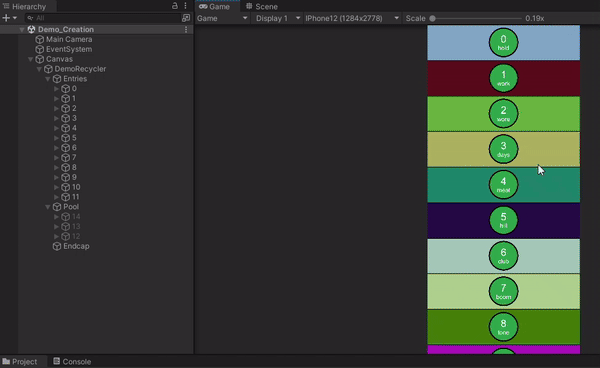

### Advanced
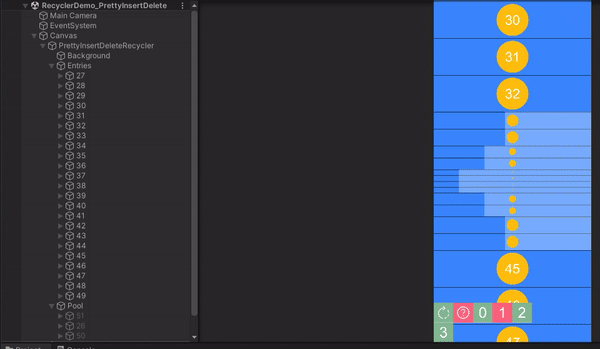

### Install

There are multiple ways to install the package:
1. Add the package through Unity's package manager using this git url: https://github.com/surmwill/recycler_unity.git?path=/RecyclerUnity/Assets/Recycler#v1.0.0 (optionally includes samples)
2. Download the `.unitypackage` from [releases](https://github.com/surmwill/recycler_unity/releases) and drag it into your project (no samples)
3. Clone this repo. The package is self-contained under . The "Samples~" folder is optional and can be safely deleted unless you wish to look at some demos

### Why do I need a Recycler?
It is common for UIs to display long lists of items. While the list of items might be large, the size of your screen is not. A recycler ensures that only the items that fit on your screen are rendered. Instead of rendering all 2000 items for example, only the 8 that can be displayed on your screen are rendered. Those 8 items will have continually be re-used, having different data swapped into and out of them as navigate our current position in the list. In short, we use a very small amount of objects to represent a huge list of data.

<b>Recyclers take time to be bug-free and effective; people want to focus on implementing UI and moving on, not debugging a tool.</b>

### The problem with other Recyclers
Every project I've worked on has inevitably needed a recycler at some point in time. These are always hastily built and lacking basic features I would expect from scrolling a list: insertion, deletion, entries of different sizes, and smoothly maintaining your scroll as all this is happening. As many teams cannot invest months into creating the perfect robust UI tool, their recycler's often fall short.

This project was intended to remedy that by creating an out-of-the-box Unity UI recycler for any use case. It supports a dynamically sized and updated list, and offers easy querying into what entries are currently on-screen or not. Entries hook into easy-to-understand lifecycle methods allowing them to manage their state.

<b>The aim of this recycler is to make it feel like a powerful tool, instead of a black box you're forced to work around.</b>

### Features
- Appending
- Prepending
- Insertion
- Deletion
- Pooling 
- Differently sized entries
- Dynamically sized entries (dimensions that change over time)
- Auto-calculated dimensions with `LayoutGroups` and `ContentSizeFitters`
- Endcap (an optional unique entry that comes at the very end of the list)
- Scrolling to any index, on-screen or off-screen
- Immediately jumping to any index, on-screen or off-screen
- Lifecycle methods for entries: when they're bound, recycled, and their visibility changes
- Queryable state of what entries are active on-screen or not; easy retrieval of any one
- "Screen Space - Camera" or "Screen Space - Overlay" canvases supported
- Vertical and horizontal orientations supported
- Only uses native Unity UI elements (uGUI)
- Fully commented and documented
- List of demos for learning and debugging
- Easy scene set up: add a recycler component to a `RectTransform` and serialize an entry prefab in it
- Free and open source: adapt it to your needs

<b>See videos of all the features [below](https://github.com/surmwill/recycler_unity/blob/master/README.md#feature-videos)</b>

# Getting Started (In One Page)

```
// 1st class: The data you'd like to display
public class DemoRecyclerData : IRecyclerScrollRectData<string>
{
    public string Key => Guid.NewGuid().ToString();  // Or any unique key

    // Anything else...
}

// 2nd class: The recycler entry component which will display your data. Make this into a prefab
public class DemoRecyclerEntry : RecyclerScrollRectEntry<string, DemoRecyclerData>
{
    [SerializeField]
    private Text _entryText = null;

    // Takes data and binds the UI to it
    protected override void OnBind(DemoRecyclerData entryData)
    {
        _entryText.text = entryData.Key;
    }
}

// 3rd class: The recycler component which displays the list of recycler entries. Add it to a `RectTransform`; drag and serialize your recycler entry prefab into it.
public class DemoRecycler : RecyclerScrollRect<string, DemoRecyclerData>
{
    // Empty: only supplies generic types
}

// In your desired script, send the recycler data
DemoRecycler recycler = GetComponent<DemoRecycler>();
IEnumerable<DemoRecyclerData> yourData = CreateYourData();
recycler.AppendEntries(yourData);
```

# Nuances

### Entries are default expanded to the Recycler's width (for a vertical recycler) or height (for a horizontal recycler).

Each entry will be expanded to the full width of the vertical recycler, or the full height for a horizontal recycler, regardless of the values you set. Should you want a different width or height, a child transform with the desired width or height can be created.

### Entries control their own auto-size.

If your content is auto-sized, then entries must control their own width and/or height with their own `ContentSizeFitter`. The root `LayoutGroup` of the entries will not do this for you.

### The only `ILayoutElements` and `ILayoutControllers` entries should have present on their roots is `LayoutGroups` and `ContentSizeFitters`.

Except during explicitly defined times all `ILayoutElements` and `ILayoutControllers` will be disabled on an entry's root for performance reasons. 
This includes things such as `Images`, which should go under a child instead. 

`LayoutGroups` and `ContentSizeFitters` can still go on the entry's root as they are needed for auto-size calculations.

### Entries must update their own height (for a vertical recycler) or width (for a horizontal recycler) through the recycler.

If we have a vertical recycler, in order for a height change to be properly reflected in the recycler, the entry must call `RecalculateDimension` to set its new height. 
Similarly, for a horizontal recycler, we would call `RecalculateDimension`, but pass its width instead.

For example, to animate an entry growing using DoTween in a vertical recycler, the below code is used to update the Recycler at each step.

```
DOTween.To(() => RectTransform.sizeDelta.y, newHeight => RecalculateDimension(newHeight), TargetHeight, Time);
```

# Getting Started (Detailed)

You will need 3 things, and this will be the same for every recycler:
1. The data you want to display in a list (a normal C# class).
2. A recycler entry that takes your data and displays it (a prefab).
3. The Recycler itself (a component).

### 1. The Data

Here is some sample data which contains a word we'd like to display along with a background color.

```
public class DemoRecyclerData : IRecyclerScrollRectData<string>
{
    // Interface implementation. Each piece of data needs a unique key identifying it.
    public string Key => Word;

    public string Word { get; private set; }
    
    public Color BackgroundColor { get; private set; }
}
```

### 2. The Recycler Entry

Recycler entries are prefabs that get passed pieces of data for display. The prefab must contain a `RecyclerScrollRectEntry<TEntryDataKey, TEntryData>` component at the root of the prefab. 
Note that as generic classes cannot be components, you must inherit from this generic class and supply your concrete types parameters (`class DemoRecyclerEntry : RecyclerScrollRectEntry<string, DemoRecyclerData> { ... }`) to create a valid component.

Upon creating the class you will be asked to implement one necessary lifecycle method, and you can optionally implement others.

The lifecycle can be described as:
1. `OnBind/OnCachedRebind` - Initialization
2. `OnVisibilityChanged` - State changes will initialized
3. `OnRecycled` - Shutdown

```
// Mandatory
protected override void OnBind(DemoRecyclerData entryData)
{
    // This entry is being passed new data to display. Set images, text, etc...
}

// Optional
protected override void OnCachedRebind()
{
    // Called instead of OnBind when the entry is being bound with data it is already bound to.
    // Note that entries stay bound to their last piece data until it is replaced with something new.
    // Therefore images, text, etc... have already been set and remain available from the last OnBind.
    // For this reason it is an optional method that can often be ignored.
}

// Optional
protected override void OnRecycled()
{
    // Called when this entry has been sent back to the recycling pool.
    // Any cleanup code can go here.
}

// Optional
protected override void OnVisibilityChanged(bool isVisible, bool isInitial)
{
    // Called when the visible state of the entry changes.
    // This callback is only invoked for active (non-recycled) entries.
}
```

For our simple example we implement `OnBind` to adjust the appearance of the entry:

```
protected override void OnBind(DemoRecyclerData entryData)
{
    // Set the word and background color to whatever is passed in the data
    _wordText.text = entryData.Word;
    _background.color = entryData.BackgroundColor;

    // Display the index (note that Index is a property found in the base class)
    _indexText.text = Index.ToString();
}
```

### 3. The Recycler

We now have the data and the means of displaying a piece of that data. What's left is to wrap it all in a Recycler component. The Recycler will pass your data to your entries as we scroll through the list.

Similar to creating the entry, there is a base `class RecyclerScrollRect<TKeyEntryData, TEntryData>`, to use as a Recycler. However, we must inherit from this generic class with our concrete types for it to be a valid component. 

```
public class DemoRecycler : RecyclerScrollRect<string, DemoRecyclerData>
{
    // Usually empty, unless the user wishes to add something custom
}
```

Add the `DemoRecycler` component to an empty RectTransform you wish for the list to appear in.

Two child GameObjects will be automatically created: `Entries` and `Pool`

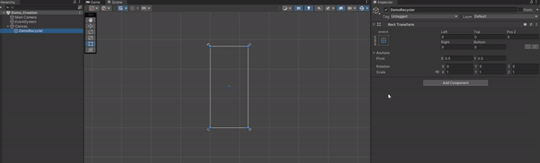

Serialize the entry prefab in the Recycler component. The pool is now filled up with entries.

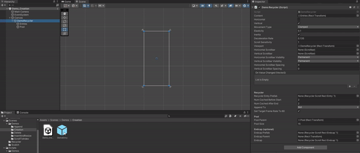

Finally, create the actual data and append it to the Recycler.

```
[SerializeField]
private DemoRecycler _recycler = null;

private static readonly string[] Words =
{ 
    "hold", "work", "wore", "days", "meat",
    "hill", "club", "boom", "tone", "grey",
    "bowl", "bell", "kick", "hope", "over",
    "year", "camp", "tell", "main", "lose",
    "earn", "name", "hang", "bear", "heat",
    "trip", "calm", "pace", "home", "bank",
    "cell", "lake", "fall", "fear", "mood",
    "head", "male", "evil", "toll", "base"
};

private void Start()
{
    // Create data containing the words from the array, each with a random background color
    DemoRecyclerData[] entryData = new DemoRecyclerData[Words.Length];
    for (int i = 0; i < Words.Length; i++)
    {
        entryData[i] = new DemoRecyclerData(Words[i], Random.ColorHSV());
    }
    
    _recycler.AppendEntries(entryData);
}
```

### End Result

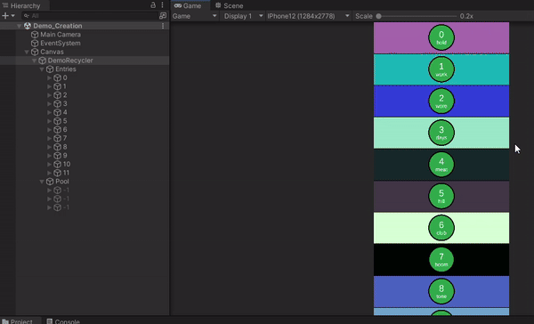

### 4. (Optional) Endcap

It might be useful to have a different entry (endcap) at the end of the list that looks and works different from all the others. For example, this endcap could have a button to fetch the next page of entries.

The process is similar to creating a normal entry. Construct your prefab, and to make it operable with the Recycler include a `RecyclerScrollRectEndcap<TEntryData, TEntryDataKey>` component at the root.  
Again, as generic classes cannot be components we must inherit from the class and supply our concrete types: `public class DemoEndcap : RecyclerScrollRectEndcap<DemoRecyclerData, string> { ... }`.

We can optionally implement these two lifecycle methods, but they are not needed here.

```
// Optional
protected virtual void OnFetchedFromPool()
{
  // Called when the endcap has been fetched from its pool and become active.      
}

// Optional
protected virtual void OnReturnedToPool()
{
  // Called when the endcap has been returned to its pool
}
```

Serialize the endcap prefab in Recyler component. A new pool for the endcap will get created:

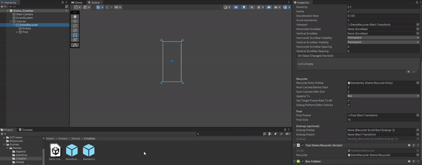

And our end result looks like:

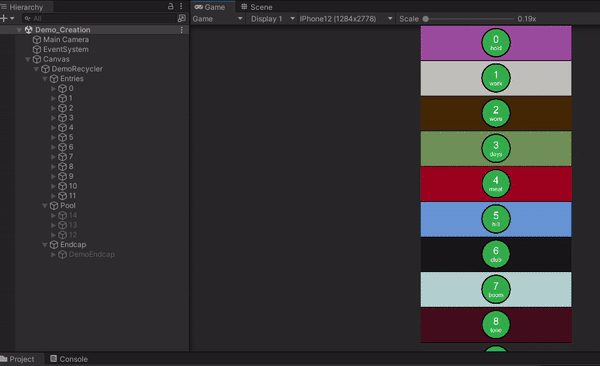

# Documentation

## RecyclerScrollRect

### InsertAtIndex
```
public void InsertAtIndex(int index, TEntryData entryData, FixEntries fixEntries)
```

Inserts an entry at the given index. Existing entries' indices will be shifted like a list insertion.

<ins>Parameters</ins>
- `index:` the index to insert the entry at
- `entryData:` the data representing the entry
- `fixEntries:` if we're inserting into the visible window of entries, then we'll need to make some room by pushing some existing entries aside. This defines how and what entries will get moved. If we're not inserting into the visible window, this is ignored, and the parameter will be overriden with whatever value only pushes other offscreen entries, preserving the view of what's on-screen.

<ins>Exceptions</ins>
- `ArgumentException:` thrown when trying to insert at an invalid index 

### InsertAtKey
```
public void InsertAtKey(TKeyEntryData insertAtKey, TEntryData entryData, FixEntries fixEntries)
```
Inserts an entry at the given key. Existing entries' indices will be shifted like a list insertion.

<ins>Parameters</ins>
- `insertAtKey:` the key to insert the entry at
- `entryData:` the data representing the entry
- `fixEntries:` if we're inserting into the visible window of entries, then we'll need to make some room by pushing some existing entries aside. This defines how and what entries will get moved. If we're not inserting into the visible window, this is ignored, and the parameter will be overriden with whatever value only pushes other offscreen entries, preserving the view of what's on-screen.

### InsertRangeAtIndex
```
public void InsertRangeAtIndex(int index, IEnumerable<TEntryData> dataForEntries, FixEntries fixEntries)
```
Inserts a range of entries at the given index. Existing entries' indices will be shifted like a list insertion.

<ins>Parameters</ins>
- `index:` the index to insert the entries at
- `dataForEntries:` the data for the entries
- `fixEntries:` if we're inserting into the visible window of entries, then we'll need to make some room by pushing some existing entries aside. This defines how and what entries will get moved. If we're not inserting into the visible window, this is ignored, and the parameter will be overriden with whatever value only pushes other offscreen entries, preserving the view of what's on-screen.

### InsertRangeAtKey
```
public void InsertRangeAtKey(TKeyEntryData insertAtKey, IEnumerable<TEntryData> dataForEntries, FixEntries fixEntries)
```
Inserts a range of entries at the given key. Existing entries' indices will be shifted - equivalent behaviour to inserting into a list.

<ins>Parameters</ins>
- `insertAtKey:` the index to insert the entries at
- `dataForEntries:` the data for the entries
- `fixEntries:` if we're inserting into the visible window of entries, then we'll need to make some room by pushing some existing entries aside. This defines how and what entries will get moved. If we're not inserting into the visible window, this is ignored, and the parameter will be overriden with whatever value only pushes other offscreen entries, preserving the view of what's on-screen.

### RemoveAtIndex
```
public void RemoveAtIndex(int index, FixEntries fixEntries)
```
Removes an element at the given index. Existing entries' indices will be shifted like a list removal.

<ins>Parameters</ins>
- `index:` the index of the entry to remove
- `fixEntries:` if we're removing from the visible window of entries, then we'll be creating some extra space for existing entries to occupy. This defines how and what entries will get moved to occupy that space. If we're not removing from the visible window, this is ignored, and the parameter will be overriden with whatever value only moves other offscreen entries, preserving the view of what's on-screen.

<ins>Exceptions</ins>
- `ArgumentException:` thrown when trying to remove an invalid index 

### RemoveAtKey
```
public void RemoveAtKey(TKeyEntryData removeAtKey, FixEntries fixEntries)
```
Removes an entry at the given key. Existing entries' indices will be shifted - equivalent behaviour to removing from a list.

<ins>Parameters</ins>
- `removeAtKey:` the key of the entry to remove
- `fixEntries:` if we're removing from the visible window of entries, then we'll be creating some extra space for existing entries to occupy. This defines how and what entries will get moved to occupy that space. If we're not removing from the visible window, this is ignored, and the parameter will be overriden with whatever value only moves other offscreen entries, preserving the view of what's on-screen.

### RemoveRangeAtIndex
```
public void RemoveRangeAtIndex(int index, int count, FixEntries fixEntries)
```
Removes a range of entries starting from the given index. Existing entries' indices will be shifted like a list removal.

<ins>Parameters</ins>
- `index:` the index to start removal at
- `count:` the number of entries to remove
- `fixEntries:` if we're removing from the visible window of entries, then we'll be creating some extra space for existing entries to occupy. This defines how and what entries will get moved to occupy that space. If we're not removing from the visible window, this is ignored, and the parameter will be overriden with whatever value only moves other offscreen entries, preserving the view of what's on-screen.

### RemoveRangeAtKey
```
public void RemoveRangeAtKey(TKeyEntryData removeAtKey, int count, FixEntries fixEntries)
```
Removes a range of entries starting from the given key. Existing entries' indices will be shifted like a list removal.

<ins>Parameters</ins>
- `removeAtKey:` the key of the entry to start removal at
- `count:` the number of entries to remove
- `fixEntries:` if we are removing from the visible window of entries, then extra room will be created, pulling entries in. This defines how and what entries will move to fill up the new space.

### AppendEntries
```
public void AppendEntries(IEnumerable<TEntryData> dataForEntries)
```
Appends entries to the end of the recycler. Appended entries will always preserve the currently visible window of entries.
Similar to an insertion at the end of the list, but more efficient.

<ins>Parameters</ins>
- `dataForEntries:` the data for the entries

### PrependEntries
```
public void PrependEntries(IEnumerable<TEntryData> entries)
```
Prepends entries to the start of the recycler. Prepended entries will always preserve the currently visible window of entries.
Existing entries' indices will be shifted like a list insertion.

<ins>Parameters</ins>
- `dataForEntries:` the data for the entries

### Clear
```
public void Clear()
```
Clears the Recycler of all entries and their underlying data.

### ResetToBeginning
```
public void ResetToBeginning()
```
Resets the Recycler to its very beginning elements.

### ScrollToIndex
```
public void ScrollToIndex(int index, ScrollToAlignment scrollToAlignment, float scrollSpeedViewportsPerSecond, Action onScrollComplete)
```
Scrolls to the entry at a given index. The entry doesn't need to be on-screen at the time of the call.

<ins>Parameters</ins>
- `index:` the index of the entry to scroll to
- `scrollToAlignment:` the position within the entry we want to center on
- `scrollSpeedViewportsPerSecond:` the speed of the scroll
- `onScrollComplete:` callback invoked once we've successfully scrolled to the entry
- `onScrollCanceled:` callback invoked when the scroll gets cancelled: either by the user scrolling to something else, or the user pressing down on the recycler

<ins>Exceptions</ins>
- `ArgumentException:` thrown when attempting to scroll to an invalid index

### ScrollToKey
```
public void ScrollToKey(TKeyEntryData key, ScrollToAlignment scrollToAlignment, float scrollSpeedViewportsPerSecond, Action onScrollComplete)
```
Scrolls to the entry with the given key. The entry doesn't need to be on-screen at the time of the call.

<ins>Parameters</ins>
- `key:` the key of the entry to scroll to
- `scrollToAlignment:` the position within the entry we want to center on
- `scrollSpeedViewportsPerSecond:` the speed of the scroll
- `onScrollComplete:` callback invoked once we've successfully scrolled to the entry
- - `onScrollCanceled:` callback invoked when the scroll gets cancelled: either by the user scrolling to something else, or the user pressing down on the recycler

### ScrollToIndexImmediate
```
public void ScrollToIndexImmediate(int index, ScrollToAlignment scrollToAlignment)
```
Immediately scrolls to the entry at a given index. The entry doesn't need to be on-screen at the time of the call.

<ins>Parameters</ins>
- `index:` the index of the entry to scroll to
- `scrollToAlignment:` the position within the entry we want to center on

<ins>Exceptions</ins>
- `ArgumentException:` thrown when attempting to scroll to an invalid index

### ScrollToKeyImmediate
```
public void ScrollToIndexImmediate(int index, ScrollToAlignment scrollToAlignment)
```
Immediately scrolls to the entry at the given key. The entry doesn't need to be on screen at the time of the call.

<ins>Parameters</ins>
- `index:` the key of the entry to scroll to.
- `scrollToAlignment:` the position within the entry we want to center on

### CancelScrollTo
```
public void CancelScrollTo()
```
Cancels the current `ScrollToIndex/Key` call.

### GetActiveEntryWithIndex
```
public TEntry GetActiveEntryWithIndex<TEntry>(int index)
```

<ins>Parameters</ins>
- `index:` the index of the active entry

<ins>Exceptions</ins>
- `ArgumentException:` thrown when the index of the entry is not active

### TryGetActiveEntryWithIndex
```
public bool TryGetActiveEntryWithIndex<TEntry>(int index, out TEntry entry)
```

Tries to get the active entry at a given index, returning true and the entry if the index is indeed active, and false otherwise.

<ins>Parameters</ins>
- `index:` the index of the active entry to try and get
- `entry:` the active entry with the given index or null

### GetActiveEntryWithKey
```
public TEntry GetActiveEntryWithKey<TEntry>(TKeyEntryData key)
```

<ins>Parameters</ins>
- `key:` the key of the active entry

<ins>Exceptions</ins>
- `ArgumentException:` thrown when the entry with the given key is not active

### TryGetActiveEntryWithKey
```
public bool TryGetActiveEntryWithKey<TEntry>(TKeyEntryData key, out TEntry entry)
```

Tries to get the active entry with the given key, returning true and the entry if it is indeed active, and false otherwise.

<ins>Parameters</ins>
- `key:` the key of the active entry
- `entry:` the active entry with the given key or null

### GetEndcap
```
public TEndcap GetEndcap<TEndcap>()
```

Returns the endcap if it exists, or null otherwise.

### DataForEntries
```
public IReadOnlyList<TEntryData> DataForEntries { get; }
```

Returns the list of data being bound to the entries.

### ActiveEntries
```
public IReadOnlyDictionary<int, RecyclerScrollRectEntry<TEntryData, TKeyEntryData>> ActiveEntries { get; }
```

Returns the currently active entries: visible and cached. The key is their index.

### ActiveEntriesWindow
```
public IRecyclerScrollRectActiveEntriesWindow ActiveEntriesWindow { get; }
```

Returns information about the current index and key ranges of active entries.

### Endcap
```
public RecyclerScrollRectEndcap<TEntryData, TKeyEntryData> Endcap { get; }
```

Returns a reference to the endcap, if it exists.

### Orientation
```
public RecyclerScrollRectOrientation Orientation { get; }
```

Defines orientation of the list (vertical or horizontal).

### OnRecyclerUpdated
```
public event Action OnRecyclerUpdated
```

Invoked at the end of LateUpdate once scrolling has been handled. 
Here, the current viewport of entries is not expected to change for the remainder of the frame except through manual user calls. 
The state of the entries can be queried here without worry of them changing.

## RecyclerScrollRectEntry

### UnboundIndex
```
public const int UnboundIndex;
```

The index corresponding to an unbound entry.

### Index
```
public int Index { get; }
```

The current index of the entry (note that indices can shift as things are added and removed).

### Data
```
public TEntryData Data { get; }
```

The data this entry is currently bound to.

### Recyler
```
public RecyclerScrollRect<TEntryData, TKeyEntryData> Recycler { get; }
```

The recycler this entry is a part of.

### RectTransform
```
public RectTransform { get; } 
```

The entry's RectTransform.

### IsVisible
```
public bool? IsVisible { get; } 
```

Whether the entry is visible on screen, or not visible and in the cache. A null value indicatees it's inactive and in the recycling pool.

### OnBind
```
protected abstract void OnBind(TEntryData entryData)
```

Lifecycle method called when the entry becomes active and bound to a new piece of data.

<ins>Parameters</ins>
- `entryData:` the data the entry is being bound to.

### OnCachedRebind
```
protected virtual void OnCachedRebind()
```

Lifecycle method called instead of `OnBind` when the data to be bound is the same data that it's already bound to.
(Note that entries maintain their state when recycled, only losing it when being bound to new data).

### OnRecycled
```
protected virtual void OnRecycled()
```

Lifecycle method called when the entry gets sent back to the recycling pool.

### OnVisibilityChanged
```
protected virtual void OnVisibilityChanged(bool isVisible, bool isInitial)
```

Lifecycle method called when the visibility of an active entry changes.
(Note that recycled entries will not have this invoked).

<ins>Parameters</ins>
- `isVisible:` whether the entry is visible in the viewport or not
- `isInitial:` whether this is the first visible state after data binding.

### RecalculateDimension
```
protected void RecalculateDimension(float newHeightOrWidth, FixEntries fixEntries)
```

Called when an entry needs to update its height in a vertical recycler or width in a horizontal recycler.

<ins>Parameters</ins>
- `newWidthOrHeight:` the new width or height the entry should be set to
- `fixEntries:` if we're updating the size of a visible entry, then we'll either be pushing other entries or creating extra space for other entries to occupy.
This defines how and what entries will get moved. If we're not updating an entry in the visible window, this is ignored, and the parameter will be overriden with whatever value only moves other offscreen entries, preserving the view of what's on-screen.

### AutoRecalculateDimension
```
protected void AutoRecalculateDimension(FixEntries fixEntries)
```

Called when an entry needs to recalculate its auto-sized height in a vertical recycler or width in a horizontal recycler.

<ins>Parameters</ins>
- `fixEntries:` if we're updating the size of a visible entry, then we'll either be pushing other entries or creating extra space for other entries to occupy.
This defines how and what entries will get moved. If we're not updating an entry in the visible window, this is ignored, and the parameter will be overriden with whatever value only moves other offscreen entries, preserving the view of what's on-screen.

## RecyclerScrollRectEndcap

### Recyler
```
public RecyclerScrollRect<TEntryData, TKeyEntryData> Recycler { get; }
```

The Recycler this endcap is a part of.

### IsVisible
```
public bool? IsVisible { get; }
```

Whether the endcap is visible in the viewport or not. Null indicates it is pooled.

### RectTransform
```
public RectTransform { get; } 
```

The endcap's RectTransform.

### OnFetchedFromPool
```
public virtual void OnFetchedFromPool()
```

Lifecycle method called by the recycler when the endcap becomes active, being fetched from its pool.

### OnSentToPool
```
public virtual void OnReturnedToPool()
```

Lifecycle method called by the recycler when the end-cap gets returned to its pool.

### OnVisiblityChanged
```
protected virtual void OnVisibilityChanged(bool isVisible, bool isInitial)
```

Called when the visibility of the endcap changes as it enters and leaves the viewport.
(Note that a pooled endcap will not have this invoked.)

<ins>Parameters</ins>
- `isVisible:` whether the endcap is visible in the viewport or not.
- `isInitial:` whether this is the first visible state of the endcap after being fetched from the pool.

### RecalculateDimension
```
protected void RecalculateDimension(float? newHeightOrWidth, FixEntries? fixEntries)
```

Called when the endcap needs to update its height in a vertical recycler or width in a horizontal recycler.

<ins>Parameters</ins>
- `newHeightOrWidth:` the height/width to set the endcap to.
- `fixEntries:` if we're updating the size of a visible endcap, then we'll either be pushing other entries or creating extra space for other entries to occupy.
This defines how and what entries will get moved. If we're not updating an endcap in the visible window, this is ignored, and the parameter will be overriden with whatever value only moves other offscreen entries, preserving the view of what's on-screen.

### AutoRecalculateDimension
```
protected void AutoRecalculateDimension(FixEntries? fixEntries)
```

Called when the endcap needs to auto-recalculate its height in a vertical recycler or width in a horizontal recycler

<ins>Parameters</ins>
- `fixEntries:` if we're updating the size of a visible endcap, then we'll either be pushing other entries or creating extra space for other entries to occupy.
This defines how and what entries will get moved. If we're not updating an endcap in the visible window, this is ignored, and the parameter will be overriden with whatever value only moves other offscreen entries, preserving the view of what's on-screen.

## IRecyclerScrollRectData

Interface for the data sent to the recycler and bound to entries. Each piece of data must provide a unique key relative to the full list of data.

### Key
```
TEntryKey Key { get; }
```

A unique key identifying the piece of data.

## IRecyclerScrollRectActiveEntriesWindow

Interface for the user to query the various index/key ranges of active entries in the recycler. 

### Exists
```
public bool Exists { get; }
```

Returns true if the window exists, that is, we have some underlying recycler data to have a window over in the first place.

### VisibleIndexRange
```
public (int Start, int End)? VisibleIndexRange { get; }
```

The range of entry indices that are visible. Null if the range is empty.

### StartCacheIndexRange
```
public (int Start, int End)? StartCacheIndexRange { get; }
```

The range of entry indices contained in the start cache. Null if the range is empty.

### EndCacheIndexRange
```
public (int Start, int End)? EndCacheIndexRange { get; }
```

The range of entry indices contained in the end cache. Null if the range is empty.

### ActiveEntriesRange
```
public (int Start, int End)? ActiveEntriesRange { get; }
```

### IsVisible
```
public bool IsVisible(int index)
```

Returns true if the entry with the given index is visible

### IsInStartCache
```
public bool IsInStartCache(int index)
```

Returns true if the entry with the given index is in the start cache

### IsInEndCache
```
public bool IsInEndCache(int index)
```

Returns true if the entry with the given index is in the end cache

### Contains
```
public bool Contains(int index)
```

Returns true if the entry with the given index is active (visible, in the start cache, or in the end cache)

### PrintRanges
```
public string PrintRanges();
```

Returns information about the current ranges of entry indices.

### GetEnumerator()
```
public IEnumerator<int> GetEnumerator()
```

Returns the indices of all the active entries in increasing order.

The range of indices of active entries: both visible and cached. Null if the range is empty.

### GetActiveKeys
```
public IEnumerable<TKeyEntryData> GetActiveKeys()
```

The range of keys of active entries: both visible and cached. Empty if the range is empty.

### GetStartCacheKeys
```
public IEnumerable<TKeyEntryData> GetStartCacheKeys()
```

Returns the keys of the entries currently in the start cache. Empty if the range is empty.

### GetEndCacheKeys
```
public IEnumerable<TKeyEntryData> GetEndCacheKeys()
```

Returns the keys of the entries currently in the end cache. Empty if the range is empty.

### IsKeyVisible
```
public bool IsKeyVisible(TKeyEntryData key)
```

Returns true if the entry with the given key is visible.

<ins>Parameters</ins>
- `key:` the key of the entry

### IsKeyInStartCache
```
public bool IsKeyInStartCache(TKeyEntryData key)
```

Returns true if the entry with the given key is in the start cache

<ins>Parameters</ins>
- `key:` the key of the entry

### IsKeyInEndCache
```
public bool IsKeyInEndCache(TKeyEntryData key)
```

Returns true if the entry with the given key is in the end cache

<ins>Parameters</ins>
- `key:` the key of the entry


### ContainsKey
```
public bool ContainsKey(TKeyEntryData key)
```

Returns true if the entry with the given key is active (visible, in the start cache, or in the end cache)

<ins>Parameters</ins>
- `key:` the key of the entry

### PrintKeyRanges
```
public string PrintKeyRanges()
```

Returns a string detailing the current range of active entry keys

## FixEntries

If we're updating the size of a visible entry, then we'll either be pushing other entries or creating extra space for other entries to occupy.
This enum specifies how and what entries will get moved.

<ins>Values</ins>
- `VerticalBelow:` all entries below the one modified will stay unmoved. 
- `VerticalAbove:` all entries above the one modified will stay unmoved.
- `HorizontalLeft:` all entries to the left of the one modified will stay unmoved.
- `HorizontalRight:` all entries to the right of the one modified will stay unmoved.
- `Middle:` all entries above and below, or to the left and right of the one modified will be moved equally.

## ScrollToAlignment

Enum defining the position within an entry to center on when we scroll to it.

<ins>Values</ins>
- `VerticalEntryBottom:` center on the bottom edge of the entry.
- `VerticalEntryTop:` center on the top edge of the entry.
- `VerticalEntryLeft:` center on the left edge of the entry.
- `VerticalEntryRight:` center on the right edge of the entry.
- `EntryMiddle:` center on the middle of the entry.

# Feature Videos
### Basic Functionality


### Insertion and deletion
Adding and deleting from the end.


Adding and deleting from the middle.

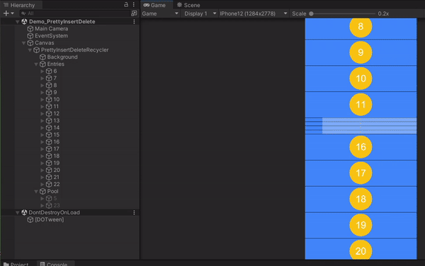

### Appending/Prepending/Endcap
- Entries are appended once the endcap becomes visible for a time
- Equivalent behaviour can be achieved for prepending
  
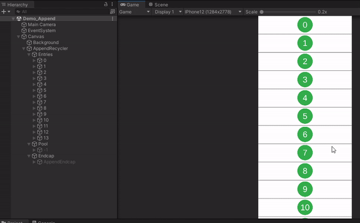

### Scrolling to index
- Here we are scrolling to index 45.
- Includes indices that are not currently active in the recycler.
- Works with dynamically sized entries.
- Center on different part of the entry: middle, top edge, bottom edge.
- An immediate scroll to any index is also available.
  
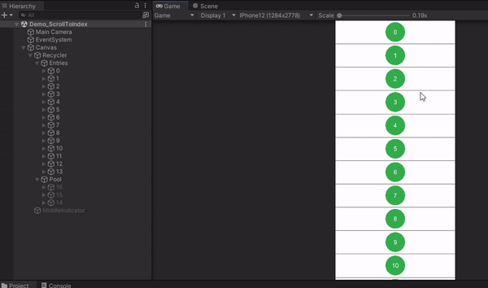

### Auto-sized entries
- Here each entry generates a random number of lines of text. The entry is auto-sized to fit the text using a `VerticalLayoutGroup` and a `ContentSizeFitter`.

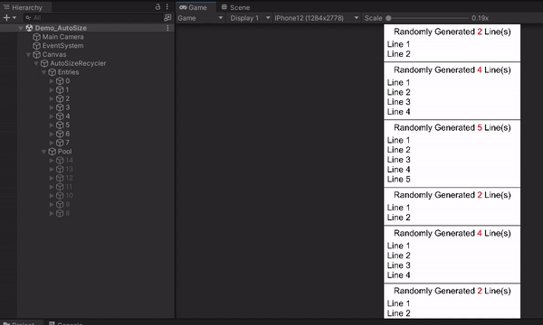

### State changes
- Know when an entry is visible or not.
- Here entries become yellow when visible, and blue when off-screen.

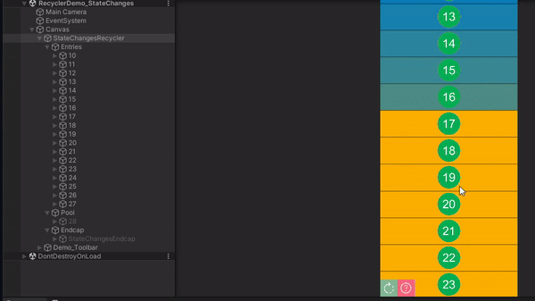

### Horizontal support
- Horizontally oriented lists are just as supported as vertical ones.

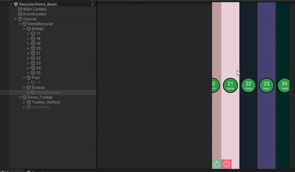
