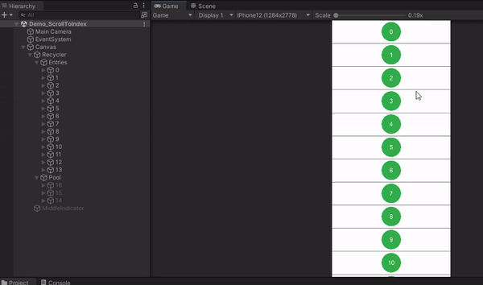

# Intro
A UI Recycler View for Unity, as a native one is not provided.

### Why do I need a Recycler?
Lists of things to display often take up more space than what is available on screen (think of endlessly scrolling through emails or text messages).
It makes no sense to waste resources on displaying what can't be seen. If we can only see 20 text messages, why spend time creating the entire 1000 message conversation?

Recyclers address this. Instead of creating the entire list of things, we only create what can be seen, and a few entries just off-screen to smoothly scroll into.
If we can only see 20 text messages on screen at a time, and we keep 2 extra messages cached on each end, waiting just above and below the screen to smoothly scroll into, we'll be managing the lifecycle of 24 things to display instead of the full 1000.
This increases performance and reduces headaches. Once an entry has gone far enough offscreen, it is not thrown away but re-used for the next visible entry we are scrolling in to.

In the feature videos below, on the left hand side (the hierarchy), you will see the current list of entries. The numbers on these entries will change as we scroll through the list.
Each number represents the current piece of data (its index) that an entry is displaying. 
Importantly, the number of entries stays small; even when we're scrolling through a list of 100s of pieces of data we always have < 20 active at any given moment. 
The changing numbers is exactly the process of recycling: re-using an old entry with new data.

### Why choose this Recycler?
Transforming Unity's ScrollRect into a Recycler is already difficult, and other packages can be found implementing a Recycler, but none offer the functionality given here.
**Other Recylers assume:**
- **Entries have static dimensions.**
  <br>(A text message would be unable to resize after creation to show an asynchronously loaded link preview.)
- **Entries all have the same dimensions.**
  <br>(Each text message would be required to take up the same amount of room in the conversation, leaving lots of empty space.)
- **The data stays static:** no inserting or removing entries without recreating the entire list.
  <br>(No inserting or deleting text messages.)
- **No endcaps**: sometimes you want one slightly different entry from the rest at the bottom of the list, as it serves a different purpose.
  <br>(A loading indicator that fetches and appends the next page of text messages from a database.)
- **No scrolling to an entry:** unless you calculate it's (x,y) or normalized scroll position yourself, which is usually unintuitive.
- **No auto-calculated layouts** you must know the size of your entries before creating them.
  <br>(You would manually have to calculate the size of each encompassing chat bubble for every message.) 

Here, **all those cases are covered with the following features:** 
- Appending
- Prepending
- Insertion
- Deletion
- Pooling 
- Dynamically sized entries (auto-calculation supported)
- Resizing (auto-calculation supported)
- Endcaps
- Scrolling to any index (including those off screen)
- State changes (know when an entry is cached, visible, or in the recycling pool)
- Works with "Screen Space - Camera" or "Screen Space - Overlay" canvases ("World Space" is untested).
- 7 (optional) editor checks running every frame, ensuring valid behaviour. 10 Demos isolating and testing each individual piece of functionality.
- Only uses native Unity UI elements
- Fully commented and documented

# Feature Videos
### Basic Functionality


### Insertion/Resizing


### Deletion (15, 17, 18)


### Appending/Prepending/Endcap
- Equivalent behaviour is available for prepending.
- Similar to insertion but more efficient.
  


### Scrolling to index (45)
- Includes indices that are not currently active in the recycler.
- Works with dynamically sized entries.
- Center on different part of the entry: middle, top edge, bottom edge.
- An immediate scroll is available.
  


### Auto-sized entries
- Here each entry generates a random number of lines of text. The entry is auto-sized to fit the text using a `VerticalLayoutGroup` and a `ContentSizeFitter`.


### State changes
- Know when an entry is cached, visible, or in the recycling pool.
- Here entries become yellow when visible, blue when in the start cache, and green when in the end cache.


# Getting Started

You will need 3 things:
1. The data you will pass to the Recycler (a normal C# class).
2. A recycler entry to bind the data to (a prefab).
3. The Recycler itself (a component).

### The Data

Here is some sample data in which we store a word to display and a background color.

```
public class DemoRecyclerData : IRecyclerScrollRectData<string>
{
    // IRecyclerScrollRectData<string> implementation
    public string Key => Word;

    public string Word { get; private set; }
    
    public Color BackgroundColor { get; private set; }
}
```

Each piece of data is required to have a unique key, implemented by the `IRecyclerScrollRectData<TEntryDataKey>` interface. 
As entries get added and removed their indices change. Instead of keeping track of all the shifting yourself, you can reference pieces of data by their unchanging keys.

(Tip: a quick way to generate unique keys without much thought or structure is to generate a `Guid.NewGuid().ToString()` as a key. Keys are passed as a parameter to reference specific pieces of data;
if you do not require such methods, the actual key is not that important apart from needing _something_ that is unique).

### The Recycler Entry

Recycler entries are prefabs that will get bound to your data. To begin, create the prefab. 

To make it operable with the Recycler you must include a `RecyclerScrollRectEntry<TEntryData, TEntryDataKey>` component at the root of the prefab. 
Specifically, as generic classes cannot be components, you must create an of instance of the generic class with your data and its corresponding key as the types `class DemoRecyclerEntry : RecyclerScrollRectEntry<DemoRecyclerData, string>`

Upon creating the class you will be asked to implement one mandatory lifecycle method, with 3 other optional ones:

```
// Mandatory
protected override void OnBindNewData(DemoRecyclerData entryData)
{
    // Called when this entry has been retrieved from the recycling pool and is being bound to new data
}

// Optional
protected override void OnRebindExistingData()
{
    // Called instead of OnBindNewData when this entry is retrieved from the recycling pool and bound.
    // Here, the only difference is the data being bound is the same data that the entry had before (and still currently contains).
    // By default, nothing gets reset when an entry gets sent to recycling; hence we can pick up from the state right where we left off, just before it got recycled.
    // We might, for example, resume a paused async operation here instead of starting it all over again.
}

// Optional
protected override void OnSentToRecycling()
{
    // Called when this entry has been sent back to the recycling pool.   
}

// Optional
protected override void OnStateChanged(RecyclerScrollRectContentState prevState, RecyclerScrollRectContentState newState)
{
    // Called when the state of the entry changes
}
```

We will use the passed data in `OnBindNewData` to adjust the appearance of the entry:

```
[SerializeField]
private Text _wordText = null;

[SerializeField]
private Text _indexText = null;

[SerializeField]
private Image _background = null;

protected override void OnBindNewData(DemoRecyclerData entryData)
{
    // Set the word and background color to whatever is passed in the data
    _wordText.text = entryData.Word;
    _background.color = entryData.BackgroundColor;

    // Display the index (note that Index is a property found in the base class)
    _indexText.text = Index.ToString();
}
```

### The Recycler

Similar to creating the entry, we have a base `class RecyclerScrollRect<TEntryData, TKeyEntryData>`, but must create an instance of this generic class (working with our data and its key) to be used as a component.

```
public class DemoRecycler : RecyclerScrollRect<DemoRecyclerData, string>
{
    // Empty, unless the user wishes to add something
}
```

Then create an empty RectTransform with the desired dimensions for the Recycler. Add our `DemoRecycler` component to that RectTransform. 

Two child GameObjects will be created: `Entries` and `Pool`


Serialize our entry prefab in the Recycler component. The pool is now filled up with entries.


Finally, create the actual data and append it to the Recycler.

```
[SerializeField]
private DemoRecycler _recycler = null;

private static readonly string[] Words =
{ 
    "hold", "work", "wore", "days", "meat",
    "hill", "club", "boom", "tone", "grey",
    "bowl", "bell", "kick", "hope", "over",
    "year", "camp", "tell", "main", "lose",
    "earn", "name", "hang", "bear", "heat",
    "trip", "calm", "pace", "home", "bank",
    "cell", "lake", "fall", "fear", "mood",
    "head", "male", "evil", "toll", "base"
};

private void Start()
{
    // Create data containing the words from the array, each with a random background color
    DemoRecyclerData[] entryData = new DemoRecyclerData[Words.Length];
    for (int i = 0; i < Words.Length; i++)
    {
        entryData[i] = new DemoRecyclerData(Words[i], Random.ColorHSV());
    }
    
    _recycler.AppendEntries(entryData);
}
```

### End Result


### (Optional) Endcap

It might be useful to have a different entry at the end of the list than the others. 
For example, this entry could have a button to fetch the next page of entries, or do so automatically upon becoming visible for a set amount of time.
(Note: while we have no problem displaying a large amount of entries, fetching all the data to make them from a database could be costly $. Hence paging is still a useful concept.) 

The process is similar to creating a normal entry. Construct your prefab, then to make it operable with the Recycler include a `RecyclerScrollRectEndcap<TEntryData, TEntryDataKey>` component at the root, filled in
with your corresponding key and data types. Again, as generic classes cannot be components we must create an instance of the generic class ourselves, and use that: `public class DemoEndcap : RecyclerScrollRectEndcap<DemoRecyclerData, string>`.

We can optionally implement these two lifecycle methods, but they are not needed here.

```
// Optional
public virtual void OnFetchedFromPool()
{
  // Called when the endcap has been fetched from its pool and become active.
  // It is either visible on screen or waiting just offscreen in the cache.        
}

// Optional
public virtual void OnReturnedToPool()
{
  // Called when the endcap has been returned to its pool
}
```

Serialize the endcap prefab in Recyler. A new pool for the endcap will get created:


And our end result looks like:


# Documentation

## RecyclerScrollRect

### InsertAtIndex
```
public void InsertAtIndex(int index, TEntryData entryData, FixEntries fixEntries)
```
Inserts an entry at the given index. Existing entries' indices will be shifted - equivalent behaviour to inserting into a list.
- `index:` the index to insert the entry at
- `entryData:` the data representing the entry
- `fixEntries:` if we are inserting into the visible window of entries, then we'll need to make some room by pushing some existing entries aside. This defines how and what entries will get moved.

### InsertAtKey
```
public void InsertAtKey(TKeyEntryData insertAtKey, TEntryData entryData, FixEntries fixEntries)
```
Inserts an entry at the given key. Existing entries' indices will be shifted - equivalent behaviour to inserting into a list.
- `insertAtKey:` the key to insert the entry at
- `entryData:` the data representing the entry
- `fixEntries:` if we are inserting into the visible window of entries, then we'll need to make some room by pushing some existing entries aside. This defines how and what entries will get moved.

### InsertRangeAtIndex
```
public void InsertRangeAtIndex(int index, IEnumerable<TEntryData> entryData, FixEntries fixEntries)
```
Inserts a range of entries at the given index. Existing entries' indices will be shifted - equivalent behaviour to inserting into a list.
- `index:` the index to insert the entries at
- `entryData:` the data for the entries
- `fixEntries:` if we are inserting into the visible window of entries, then we'll need to make some room by pushing some existing entries aside. This defines how and what entries will get moved.

### InsertRangeAtKey
```
public void InsertRangeAtKey(TKeyEntryData insertAtKey, IEnumerable<TEntryData> entryData, FixEntries fixEntries)
```
Inserts a range of entries at the given key. Existing entries' indices will be shifted - equivalent behaviour to inserting into a list.
- `insertAtKey:` the index to insert the entries at
- `entryData:` the data for the entries
- `fixEntries:` if we are inserting into the visible window of entries, then we'll need to make some room by pushing some existing entries aside. This defines how and what entries will get moved.

### RemoveAtIndex
```
public void RemoveAtIndex(int index, FixEntries fixEntries)
```
Removes an entry at the given index. Existing entries' indices will be shifted - equivalent behaviour to removing from a list.
- `index:` the index of the entry to remove
- `fixEntries:` if we are removing from the visible window of entries, then extra room will be created, pulling entries in. This defines how and what entries will move to fill up the new space.

### RemoveAtKey
```
public void RemoveAtIndex(TKeyEntryData removeAtKey, FixEntries fixEntries)
```
Removes an entry at the given key. Existing entries' indices will be shifted - equivalent behaviour to removing from a list.
- `removeAtKey:` the key of the entry to remove
- `fixEntries:` if we are removing from the visible window of entries, then extra room will be created, pulling entries in. This defines how and what entries will move to fill up the new space.

### RemoveRangeAtIndex
```
public void RemoveRangeAtIndex(int index, int count, FixEntries fixEntries)
```
Removes a range of entries starting from the given index. Existing entries' indices will be shifted - equivalent behavior to removing from a list.
- `index:` the index to start removal at
- `count:` the number of entries to remove
- `fixEntries:` if we are removing from the visible window of entries, then extra room will be created, pulling entries in. This defines how and what entries will move to fill up the new space.

### RemoveRangeAtKey
```
public void RemoveRangeAtKey(TKeyEntryData removeAtKey, int count, FixEntries fixEntries)
```
Removes a range of entries starting from the given key. Existing entries' indices will be shifted - equivalent behavior to removing from a list.
- `removeAtKey:` the key of the entry to start removal at
- `count:` the number of entries to remove
- `fixEntries:` if we are removing from the visible window of entries, then extra room will be created, pulling entries in. This defines how and what entries will move to fill up the new space.

### AppendEntries
```
public void AppendEntries(IEnumerable<TEntryData> entries)
```
Appends a range of entries to the end of the existing list of data. 

Functionally equivalent to insertion, but more efficent. Prefer to use this when feasible.

- `entries:` the data for the entries

### PrependEntries
```
public void PrependEntries(IEnumerable<TEntryData> entries)
```
Prepends a range of entries to the beginning of the existing list of data. Existing entries' indices will be shifted - equivalent behavior to removing from a list.

- `entries:` the data for the entries

### Clear
```
public void Clear()
```
Clears the Recycler of all entries and their underlying data.

### ResetToBeginning
```
public void ResetToBeginning()
```
Resets the Recycler to its very beginning elements.

### ScrollToIndex
```
public void ScrollToIndex(int index, ScrollToAlignment scrollToAlignment, Action onScrollComplete, float scrollSpeedViewportsPerSecond, bool isImmediate)
```
Scrolls to an entry at a given index. The entry doesn't need to be on screen at the time of the call.

- `index:` the index of the entry to scroll to
- `scrollToAlignment:` the position within the entry we want to center on (ex: the middle, the top edge, the bottom edge)
- `onScrollComplete:` callback invoked once we've successfully scrolled to the entry
- `scrollSpeedViewportsPerSecond:` the speed of the scroll, defined in viewports per second (ex: a value of 1 means we'll scroll past 1 full screen of entries every second)
- `isImmediate:` whether the scroll should complete immediately. Warning: the scroll still occurs - just in one frame - meaning large jumps are costly.

### ScrollToKey
```
public void ScrollToKey(TKeyEntryData key, ScrollToAlignment scrollToAlignment, Action onScrollComplete, float scrollSpeedViewportsPerSecond, bool isImmediate)
```
Scrolls to an entry with the given key. The entry doesn't need to be on screen at the time of the call.

- `key:` the key of the entry to scroll to
- `scrollToAlignment:` the position within the entry we want to center on (ex: the middle, the top edge, the bottom edge)
- `onScrollComplete:` callback invoked once we've successfully scrolled to the entry
- `scrollSpeedViewportsPerSecond:` the speed of the scroll, defined in viewports per second (ex: a value of 1 means we'll scroll past 1 full screen of entries every second)
- `isImmediate:` whether the scroll should complete immediately. Warning: the scroll still occurs - just in one frame - meaning large jumps are costly.

### CancelScrollTo
```
public void CancelScrollTo()
```
Cancels the current [`ScrollToIndex`](https://github.com/surmwill/recycler_unity/blob/master/README.md#scrolltoindex)/[`ScrollToKey`](https://github.com/surmwill/recycler_unity/blob/master/README.md#scrolltoindex) animation.

### GetCurrentIndexForKey
```
public int GetCurrentIndexForKey(TKeyEntryData key)
```
Returns the current index of the entry with a given key.

- `key:` the key of the entry to get the current index of

### GetKeyForCurrentIndex
```
public TKeyEntryData GetKeyForCurrentIndex(int index)
```

- `index:` the index of entry to get the key of

### GetStateOfEntryWithCurrentIndex
```
public RecyclerScrollRectContentState GetStateOfEntryWithCurrentIndex(int index)
```
Returns the state of the entry with a given index. Either:
1. ActiveVisible: active and visible on screen
2. ActiveInStartCache: active, but waiting just off screen in the start cache, ready to scroll to
3. ActiveInEndCache: active, but waiting just off screen in the end cache, ready to scroll to
4. InactiveInPool: inactive and waiting in the recycling pool to be bound/re-bound

- `index:` the index of the entry to check the state of

### GetStateOfEntryWithKey
```
public RecyclerScrollRectContentState GetStateOfEntryWithCurrentIndex(TKeyEntryData key)
```
Returns the state of the entry with the given key. Either:
1. ActiveVisible: active and visible on screen
2. ActiveInStartCache: active, but waiting just off screen in the start cache, ready to scroll to
3. ActiveInEndCache: active, but waiting just off screen in the end cache, ready to scroll to
4. InactiveInPool: inactive and waiting in the recycling pool to be bound/re-bound

- `key:` the key of the entry to check the state of

### GetStateOfEndcap
```
public RecyclerScrollRectContentState GetStateOfEndcap()
```
Returns the state of the endcap. Either:
1. ActiveVisible: active and visible on screen
3. ActiveInEndCache: active, but waiting just off screen in the end cache, ready to scroll to
4. InactiveInPool: inactive and waiting in the recycling pool

### RecalculateEntrySize
```
public void RecalculateEntrySize(RecyclerScrollRectEntry<TEntryData, TKeyEntryData> entry, FixEntries fixEntries = FixEntries.Below)
```
Called by entries to alert the Recyler of their size change. This should never need to be called directly, but instead though the entry's [`RecyclerScrollRectEntry.RecalculateDimensions`](https://github.com/surmwill/recycler_unity/blob/master/README.md#recalculatedimensions).

- `entry:` the entry with an updated size
- `fixEntries:` as the RectTransform grows or shrinks other entries will get pushed away, or pulled in to the empty space. This defines how and what entries will move.

### RecalculateEndcapSize
```
public void RecalculateEndcapSize()
```
Called by the endcap to alert the Recycler of its size change. This should never need to be called directly, but instead through the endcap's [`RecyclerScrollRectEndcap.RecalculateDimensions`](https://github.com/surmwill/recycler_unity/blob/master/README.md#recalculatedimensions-1).

### DataForEntries
```
public IReadOnlyList<TEntryData> DataForEntries { get; }
```

Returns the list of data being bound to the entries.

### ActiveEntries
```
public IReadOnlyDictionary<int, RecyclerScrollRectEntry<TEntryData, TKeyEntryData>> ActiveEntries { get; }
```

Returns the currently active entries (both visible on-screen and cached just off-screen), which can be looked up by their index. Note that `GetStateOfEntry` can be called on any entry here for a more fine-grained state, and, for example, to decipher which entries are in the cache and which are visible.

### ActiveEntriesWindow
```
public IRecyclerScrollRectActiveEntriesWindow ActiveEntriesWindow { get; }
```

Returns information about the current index ranges of active entries. Queryable is:
1. The range of indices of visible entries
2. The range of indices of entries in the start cache
3. The range of indices of entries in the end cache
4. The total range of active entries (start cache, visible, and end cache)

The indices returned can be combined with [`GetKeyForCurrentIndex`](https://github.com/surmwill/recycler_unity/blob/master/README.md#getkeyforcurrentindex) to get ranges of keys. 

These ranges also provide additional information about the entries returned in [`ActiveEntries`](https://github.com/surmwill/recycler_unity/blob/master/README.md#activeentries) without needing to go through the entire dictionary.

### Endcap
```
public RecyclerScrollRectEndcap<TEntryData, TKeyEntryData> Endcap { get; }
```

Returns a reference to the endcap (if it exists - it is optional).

### OnRecyclerUpdated
```
public event Action OnRecyclerUpdated
```

Invoked at the end of LateUpdate once scrolling has been handled, and the current viewport of entries is not expected to change (this frame) except through manual user calls (Insert, Delete, etc...). The state of the entries can be queried here without worry of them changing.

## RecyclerScrollRectEntry

### UnboundIndex
```
public const int UnboundIndex;
```

The index corresponding to an unbound entry.

### Index
```
public int Index { get; }
```

The current index of the entry (note that indices can shift as things are added/removed).

### Data
```
public TEntryData Data { get; }
```

The data this entry is currently bound to.

### State
```
public RecyclerScrollRectContentState State { get; }
```

The current state of the entry: visible, cached, or in the recycling pool. Valid post-binding/rebinding.

### Recyler
```
public RecyclerScrollRect<TEntryData, TKeyEntryData> Recycler { get; }
```

A reference to the Recyler containing this entry.

### RectTransform
```
public RectTransform { get; } 
```

A saved reference to the entry's RectTransform for quick access.

### OnBindNewData
```
protected abstract void OnBindNewData(TEntryData entryData)
```

Lifecycle method called when the entry is retrieved from recycling and gets bound to a new piece of data. Use the data to adjust the appearance and state of the entry.

- `entryData:` the new data that the entry is being bound to

### OnRebindExistingData
```
protected virtual void OnRebindExistingData()
```

Optional lifecycle method called instead of [`OnBindNewData`](https://github.com/surmwill/recycler_unity/blob/master/README.md#onbindnewdata) when the entry is retrieved from recycling and bound. Here, the only difference is the data being bound is the same data that the entry had before, and still currently contains. We might, for example, resume a paused async operation here instead of starting it all over again. By default, nothing gets reset when an entry gets sent to recycling; hence we can pick up from the state right where we left off, just before it got recycled.

### OnSentToRecycling
```
protected virtual void OnSentToRecyling()
```

Optional lifecycle method called when the entry gets sent back to the recycling pool.

### OnStateChanged
```
protected virtual void OnStateChanged(RecyclerScrollRectContentState prevState, RecyclerScrollRectContentState newState)
```

Optional lifecycle method called when the state of the entry changes. The entry can be in the following states:
1. InactiveInPool
2. ActiveVisible
3. ActiveInStartCache
4. ActiveInEndCache

The entry starts in 1.

The process of binding/rebinding moves the entry from 1 -> 2, 3, or 4.

While active, the entry fluctuates between states 2, 3, and 4.

Once the entry moves too far offscreen, it will move from state 3 or 4 -> 1.

The cycle repeats.

- `prevState:` the previous state the entry was in.
- `newState:` the new state the entry is currently in.

### RecalculateDimensions
```
protected void RecalculateDimensions(FixEntries fixEntries)
```

After modifying the dimensions of the entry, call this to alert the Recycler to its size change and to re-align its content. Note that a layout rebuild is triggered before alerting the Recycler, re-calculating any auto-sized content.

- `fixEntries:` resizing an entry will cause the entire list of entries to shift based on the new/removed space. This defines how and what entries will get moved.

### Other

Below are public functions that are called on the entries by the Recycler. That is, they are intended for interaction between the Recycler and the entry,  _not users_. They are listed here for the sake of completeness.

#### BindNewData
`public void BindNewData(int index, TEntryData entryData)`

Called by the Recycler to bind the entry to a new set of data.

#### RebindExisingData
`public void RebindExistingData()`

Called by the Recycler to bind to rebind the entry to its current set of data.

#### OnRecycled
`public void OnRecycled()`

Called by the Recycler when the entry gets recycled.

#### UnbindIndex
`public void UnbindIndex()`

Called by the Recycler to reset the entry to its default unbound index.

#### SetIndex
`public void SetIndex(int index)`

Called by the Recycler to set the the entry's index.

### SetState
`public void SetState(RecyclerScrollRectContentState newState)`

Called by the Recycler to set the entry's state.

## RecyclerScrollRectEndcap

### Recyler
```
public RecyclerScrollRect<TEntryData, TKeyEntryData> Recycler { get; }
```

A reference to the Recyler containing this endcap.

### State
```
public RecyclerScrollRectContentState State { get; }
```

The state of the endcap: visible, cached, or in its pool. Valid post-fetching from its pool.

### RectTransform
```
public RectTransform { get; } 
```

A saved reference to the endcaps's RectTransform for quick access.

### OnFetchedFromPool
```
public virtual void OnFetchedFromPool()
```

Optional lifecycle method called when the endcap is retrieved from its pool and becomes active.

### OnSentToPool
```
public virtual void OnReturnedToPool()
```

Optional lifecycle method called when the endcap gets returned to its pool

### OnStateChanged
```
protected virtual void OnStateChanged(RecyclerScrollRectContentState prevState, RecyclerScrollRectContentState newState)
```

Optional lifecycle method called when the state of the endcap changes. The endcap can be in the following states:
1. InactiveInPool
2. ActiveVisible
3. ActiveInEndCache

The endcap starts in 1.

The process of fetching from its pool moves the entry from 1 -> 2 or 3.

While active, the endcap fluctuates between states 2 and 3.

Once the entry moves too far offscreen, it will move from 3 -> 1.

The cycle repeats.

- `prevState:` the previous state the endcap was in.
- `newState:` the new state the endcap is currently in.

### RecalculateDimensions
```
protected void RecalculateDimensions(FixEntries? fixEntries)
```

After modifying the dimensions of the endcap, call this to alert the Recycler to its size change and to re-align its content. Note that a layout rebuild is triggered before alerting the Recycler, re-calculating any auto-sized content.

- `fixEntries:` resizing the endcap will cause the entire list of entries to shift based on the new/removed space. This defines how and what entries will get moved.

# Nuances

### Entries set their own auto-size.

If your content is not auto-sized, this is not an issue. Otherwise, entries must control their own width and height as a side effect of necessary performance concessions (editor checks will ensure this).

Instead of what is typically done, with having the root (Entries) controlling sizes:

<pre>
Entries
  |- Entry 1 (<strong>VerticalLayoutGroup</strong> with <i>controlChildHeight</i>, <i>controlChildWidth</i> checked)
  |- Entry 2 (<strong>VerticalLayoutGroup</strong> with <i>controlChildHeight</i>, <i>controlChildWidth</i> checked)
  |- Entry 3 (<strong>VerticalLayoutGroup</strong> with <i>controlChildHeight</i>, <i>controlChildWidth</i> checked)
</pre>
  
We need:

<pre>
Entries
  |- Entry 1 (<strong>VerticalLayoutGroup</strong> with <i>controlChildHeight</i>, <i>controlChildWidth</i> checked, and a <strong>ContentSizeFitter</strong>)
  |- Entry 2 (<strong>VerticalLayoutGroup</strong> with <i>controlChildHeight</i>, <i>controlChildWidth</i> checked, and a <strong>ContentSizeFitter</strong>)
  |- Entry 3 (<strong>VerticalLayoutGroup</strong> with <i>controlChildHeight</i>, <i>controlChildWidth</i> checked, and a <strong>ContentSizeFitter</strong>)
</pre>

### Entries are default expanded to the Recycler's width.

The root transform of each entry will be force expanded to the width of the recycler. Should you want a different width, a child transform with the desired width can be created and the root left empty.

### The only `ILayoutElements` and `ILayoutControllers` entries should have present on their roots is `LayoutGroups` and `ContentSizeFitters`.

Except during explicitly defined times all `ILayoutElements` and `ILayoutControllers` will be disabled on an entry's root for performance reasons. 
This includes things such as `Images`, which should go under a child transform instead. 

`LayoutGroups` and `ContentSizeFitters` can still go on the root as they are needed for auto-size calculations.

### The Recycler must be manually informed of an entry's dimension changes.

Every dimension change of an entry, except during binding/rebinding, must be followed by a call [RecalculateDimensions](https://github.com/surmwill/recycler_unity/tree/master/README.md#recalculatedimensions) to alert the Recycler of it.

For example, to animate an entry growing using DoTween, the below code is used to update the Recycler at each step.

```
RectTransform.DOSizeDelta(RectTransform.sizeDelta.WithY(GrowSize), GrowTimeSeconds)
            .OnUpdate(() => RecalculateDimensions());
```

# Code
Scripts can be found under:
- [RecyclerUnity/Assets/Scripts/Recycler/](RecyclerUnity/Assets/Scripts/Recycler/)

The two core classes - the Recycler and its entries - can be found under: 
- [RecyclerUnity/Assets/Scripts/Recycler/RecyclerScrollRect.cs](RecyclerUnity/Assets/Scripts/Recycler/RecyclerScrollRect.cs)
- [RecyclerUnity/Assets/Scripts/Recycler/RecyclerScrollRectEntry.cs](RecyclerUnity/Assets/Scripts/Recycler/RecyclerScrollRectEntry.cs) 
